# Database ERD — Sistema de Gestión de Construcción

> **Motor:** PostgreSQL 16 · **ORM:** Prisma 5 · **Moneda:** ARS (Decimal 15,2) · **Multi-tenant:** `organizationId` en cada entidad · **Soft-delete:** campo `deletedAt`

---

## Tabla de contenidos

1. [Resumen de modelos](#resumen-de-modelos)
2. [Diagrama global (núcleo)](#diagrama-global-núcleo)
3. [Dominio: Auth y Organización](#dominio-auth-y-organización)
4. [Dominio: Proyectos y Plan de Trabajo](#dominio-proyectos-y-plan-de-trabajo)
5. [Dominio: Presupuesto Versionado](#dominio-presupuesto-versionado)
6. [Dominio: APU — Análisis de Precios Unitarios](#dominio-apu--análisis-de-precios-unitarios)
7. [Dominio: Avance Físico y Certificaciones](#dominio-avance-físico-y-certificaciones)
8. [Dominio: Subcontrataciones](#dominio-subcontrataciones)
9. [Dominio: Redeterminación de Precios](#dominio-redeterminación-de-precios)
10. [Dominio: Monedas y Tipos de Cambio](#dominio-monedas-y-tipos-de-cambio)
11. [Dominio: Gastos y Compras](#dominio-gastos-y-compras)
12. [Dominio: Proveedores y Materiales](#dominio-proveedores-y-materiales)
13. [Dominio: Empleados y Asistencia](#dominio-empleados-y-asistencia)
14. [Dominio: Catálogos (Mano de Obra y Equipos)](#dominio-catálogos-mano-de-obra-y-equipos)
15. [Dominio: Plan Financiero](#dominio-plan-financiero)
16. [Dominio: Soporte (Docs, Notificaciones, Auditoría)](#dominio-soporte)
17. [Enums](#enums)
18. [Reglas de integridad](#reglas-de-integridad)

---

## Resumen de modelos

| # | Modelo | Dominio | Descripción |
|---|--------|---------|-------------|
| 1 | `Organization` | Auth | Empresa constructora (tenant raíz) |
| 2 | `User` | Auth | Usuario del sistema |
| 3 | `RefreshToken` | Auth | Tokens JWT de refresco |
| 4 | `Project` | Proyectos | Obra o proyecto de construcción |
| 5 | `Stage` | Plan de trabajo | Rubro o Tarea del proyecto (árbol padre/hijo) |
| 6 | `Task` | Plan de trabajo | Ítem de trabajo dentro de una Tarea |
| 7 | `TaskDependency` | Plan de trabajo | Dependencias entre ítems (FS/SS/FF/SF) |
| 8 | `TaskAssignment` | Plan de trabajo | Asignación de usuario/empleado a ítem |
| 9 | `BudgetVersion` | Presupuesto | Versión de presupuesto con coeficiente K |
| 10 | `BudgetCategory` | Presupuesto | Rubro del presupuesto (nivel 1) |
| 11 | `BudgetStage` | Presupuesto | Tarea del presupuesto (nivel 2) |
| 12 | `BudgetItem` | Presupuesto | Ítem del presupuesto (nivel 3) |
| 13 | `PriceAnalysis` | APU | Análisis de precios unitarios por ítem |
| 14 | `AnalysisMaterial` | APU | Componente de materiales en APU |
| 15 | `AnalysisLabor` | APU | Componente de mano de obra en APU |
| 16 | `AnalysisEquipment` | APU | Componente de equipos en APU |
| 17 | `AnalysisTransport` | APU | Componente de transporte en APU |
| 18 | `ItemProgress` | Avance | Registro de avance físico por ítem |
| 19 | `Certificate` | Certificaciones | Certificado de obra |
| 20 | `CertificateItem` | Certificaciones | Línea de ítem en certificado |
| 21 | `Subcontract` | Subcontrataciones | Subcontrato con contratista |
| 22 | `SubcontractItem` | Subcontrataciones | Ítem del subcontrato |
| 23 | `SubcontractCertificate` | Subcontrataciones | Certificado de subcontrato |
| 24 | `SubcontractCertificateItem` | Subcontrataciones | Línea de ítem en certificado de subcontrato |
| 25 | `PriceIndex` | Redeterminación | Índice de precios (INDEC, etc.) |
| 26 | `PriceIndexValue` | Redeterminación | Valor histórico de índice |
| 27 | `AdjustmentFormula` | Redeterminación | Fórmula de ajuste polinómica |
| 28 | `AdjustmentWeight` | Redeterminación | Ponderación de componente en fórmula |
| 29 | `Currency` | Monedas | Moneda (ARS, USD, EUR) |
| 30 | `ExchangeRate` | Monedas | Tipo de cambio por fecha |
| 31 | `Budget` | Gastos | Presupuesto operativo por categoría |
| 32 | `ExpenseCategory` | Gastos | Categoría de gasto |
| 33 | `Expense` | Gastos | Gasto registrado |
| 34 | `ExpenseItem` | Gastos | Línea de detalle de gasto |
| 35 | `PurchaseOrder` | Compras | Orden de compra |
| 36 | `PurchaseOrderItem` | Compras | Línea de OC |
| 37 | `Supplier` | Proveedores | Proveedor con datos fiscales argentinos |
| 38 | `MaterialCategory` | Materiales | Categoría de material (árbol) |
| 39 | `Material` | Materiales | Material con stock |
| 40 | `SupplierMaterial` | Materiales | Precio de material por proveedor |
| 41 | `StockMovement` | Materiales | Movimiento de stock |
| 42 | `Quote` | Cotizaciones | Cotización a proveedor |
| 43 | `QuoteItem` | Cotizaciones | Línea de cotización |
| 44 | `Employee` | Empleados | Empleado con datos argentinos (CUIL, DNI) |
| 45 | `EmployeeProjectAssignment` | Empleados | Asignación de empleado a proyecto |
| 46 | `Attendance` | Empleados | Registro de asistencia |
| 47 | `LaborCategory` | Catálogos | Categoría de mano de obra con cargas sociales |
| 48 | `EquipmentCatalogItem` | Catálogos | Equipo del catálogo con costos horarios |
| 49 | `FinancialPlan` | Plan Financiero | Plan financiero del proyecto |
| 50 | `FinancialPeriod` | Plan Financiero | Período mensual del plan financiero |
| 51 | `Notification` | Soporte | Notificación al usuario |
| 52 | `EmailQueue` | Soporte | Cola de emails pendientes |
| 53 | `Document` | Soporte | Documento adjunto al proyecto |
| 54 | `Attachment` | Soporte | Adjunto de gasto/OC/cotización |
| 55 | `Comment` | Soporte | Comentario en proyecto/tarea |
| 56 | `AuditLog` | Soporte | Log de auditoría de acciones |
| 57 | `SystemConfig` | Soporte | Configuración de sistema clave-valor |

---

## Diagrama global (núcleo)

Relaciones principales entre los dominios:

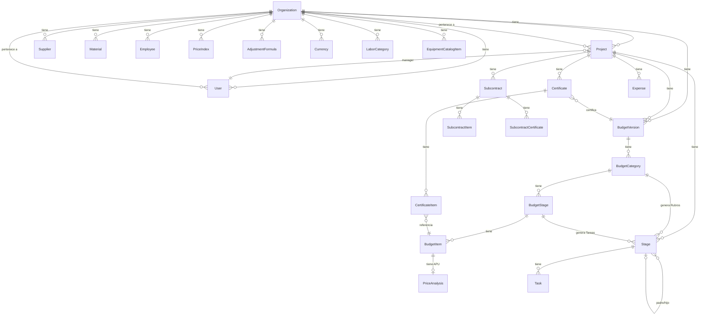

---

## Dominio: Auth y Organización

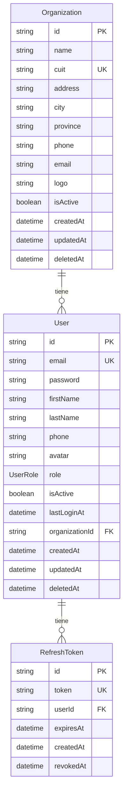

**Notas:**
- `Organization` es el tenant raíz. Todos los modelos tienen `organizationId`.
- `UserRole`: ADMIN · PROJECT_MANAGER · SUPERVISOR · ADMINISTRATIVE · READ_ONLY
- `RefreshToken` se elimina en cascada con el usuario.

---

## Dominio: Proyectos y Plan de Trabajo

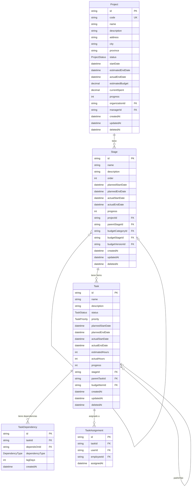

**Jerarquía del plan de trabajo:**
- **Rubro** (Stage raíz, sin `parentStageId`) — generado desde `BudgetCategory`
- **Tarea** (Stage hijo, con `parentStageId`) — generado desde `BudgetStage`
- **Ítem** (Task) — creado manualmente; anteriormente se vinculaba a `BudgetItem`

**Estados de Ítem (TaskStatus):** PENDING · IN_PROGRESS · COMPLETED · BLOCKED · CANCELLED
**Prioridades (TaskPriority):** LOW · MEDIUM · HIGH · URGENT
**Tipos de dependencia (DependencyType):** FS · SS · FF · SF

---

## Dominio: Presupuesto Versionado

```mermaid
erDiagram
    BudgetVersion {
        string id PK
        string code UK
        int version
        string name
        string description
        BudgetVersionStatus status
        datetime approvedAt
        string approvedById FK
        decimal gastosGeneralesPct
        decimal beneficioPct
        decimal gastosFinancierosPct
        decimal ivaPct
        decimal coeficienteK
        decimal totalCostoCosto
        decimal totalPrecio
        string projectId FK
        string organizationId FK
        datetime createdAt
        datetime updatedAt
        datetime deletedAt
    }

    BudgetCategory {
        string id PK
        int number
        string name
        string description
        int order
        decimal subtotalCostoCosto
        string budgetVersionId FK
        datetime createdAt
        datetime updatedAt
    }

    BudgetStage {
        string id PK
        string number
        string description
        string unit
        decimal quantity
        decimal unitPrice
        decimal totalPrice
        decimal incidencePct
        string categoryId FK
        datetime createdAt
        datetime updatedAt
    }

    BudgetItem {
        string id PK
        string number
        string description
        string unit
        decimal quantity
        decimal unitPrice
        decimal totalPrice
        string stageId FK
        datetime createdAt
        datetime updatedAt
    }

    BudgetVersion ||--o{ BudgetCategory : "tiene Rubros"
    BudgetCategory ||--o{ BudgetStage : "tiene Tareas"
    BudgetStage ||--o{ BudgetItem : "tiene Ítems"
    BudgetItem ||--o| PriceAnalysis : "tiene APU"
```

**Jerarquía del presupuesto:**
1. **Rubro** (`BudgetCategory`) — agrupa tareas, numerado secuencialmente (1, 2, 3…)
2. **Tarea** (`BudgetStage`) — tiene cantidad × precio unitario, incidencia % sobre total
3. **Ítem** (`BudgetItem`) — detalle del trabajo, vinculable a APU

**Coeficiente K:** `K = (1 + GG%) × (1 + Beneficio%) × (1 + GF%) × (1 + IVA%)`
**Precio final:** `totalPrecio = totalCostoCosto × K`

**Estados (BudgetVersionStatus):** DRAFT → APPROVED → SUPERSEDED

**Al aprobar** un presupuesto se genera automáticamente el cronograma:
- Cada `BudgetCategory` → `Stage` raíz (Rubro)
- Cada `BudgetStage` → `Stage` hijo (Tarea)
- Los `BudgetItem` **no** se sincronizan al cronograma

---

## Dominio: APU — Análisis de Precios Unitarios

```mermaid
erDiagram
    PriceAnalysis {
        string id PK
        string code UK
        decimal totalMaterials
        decimal totalLabor
        decimal totalTransport
        decimal totalEquipAmort
        decimal totalRepairs
        decimal totalFuel
        decimal totalDirect
        string budgetItemId FK_UK
        string organizationId FK
        datetime createdAt
        datetime updatedAt
    }

    AnalysisMaterial {
        string id PK
        string description
        string indecCode
        string unit
        decimal quantity
        decimal unitCost
        decimal wastePct
        decimal totalCost
        string currencyId FK
        decimal exchangeRate
        string priceAnalysisId FK
    }

    AnalysisLabor {
        string id PK
        string category
        decimal quantity
        decimal hourlyRate
        decimal totalCost
        decimal baseSalary
        decimal attendancePct
        decimal socialChargesPct
        decimal artPct
        string laborCategoryId FK
        string priceAnalysisId FK
    }

    AnalysisEquipment {
        string id PK
        string description
        decimal powerHp
        decimal newValue
        decimal residualPct
        decimal amortInterest
        decimal repairsCost
        decimal fuelCost
        decimal lubricantsCost
        decimal hourlyTotal
        decimal hoursUsed
        decimal totalCost
        string section
        string currencyId FK
        decimal exchangeRate
        string equipmentCatalogId FK
        string priceAnalysisId FK
    }

    AnalysisTransport {
        string id PK
        string description
        string unit
        decimal quantity
        decimal unitCost
        decimal totalCost
        string priceAnalysisId FK
    }

    BudgetItem ||--|| PriceAnalysis : "tiene (1:1)"
    PriceAnalysis ||--o{ AnalysisMaterial : "materiales"
    PriceAnalysis ||--o{ AnalysisLabor : "mano de obra"
    PriceAnalysis ||--o{ AnalysisEquipment : "equipos"
    PriceAnalysis ||--o{ AnalysisTransport : "transporte"
    AnalysisLabor }o--o| LaborCategory : "catálogo MO"
    AnalysisEquipment }o--o| EquipmentCatalogItem : "catálogo equipos"
```

**Secciones del APU:**
- **Materiales** — con código INDEC, desperdicio, soporte multi-moneda
- **Mano de Obra** — con cargas sociales, ART, asistencia; vinculable a `LaborCategory`
- **Equipos (D/E/F)** — amortización, reparaciones, combustible, lubricantes; vinculable a `EquipmentCatalogItem`
- **Transporte** — flete y acarreo

---

## Dominio: Avance Físico y Certificaciones

```mermaid
erDiagram
    ItemProgress {
        string id PK
        date date
        decimal advance
        string notes
        string budgetItemId FK
        string registeredById FK
        datetime createdAt
        datetime updatedAt
    }

    Certificate {
        string id PK
        string code UK
        int number
        CertificateStatus status
        date periodStart
        date periodEnd
        decimal subtotal
        decimal acopioPct
        decimal acopioAmount
        decimal anticipoPct
        decimal anticipoAmount
        decimal fondoReparoPct
        decimal fondoReparoAmount
        decimal adjustmentFactor
        decimal ivaPct
        decimal ivaAmount
        decimal totalAmount
        datetime submittedAt
        datetime approvedAt
        string approvedById FK
        string budgetVersionId FK
        string projectId FK
        string organizationId FK
        datetime createdAt
        datetime updatedAt
        datetime deletedAt
    }

    CertificateItem {
        string id PK
        string itemNumber
        string description
        string unit
        decimal quantity
        decimal unitPrice
        decimal previousAdvance
        decimal previousAmount
        decimal currentAdvance
        decimal currentAmount
        decimal totalAdvance
        decimal totalAmount
        string certificateId FK
        string budgetItemId FK
    }

    BudgetItem ||--o{ ItemProgress : "registra avance"
    Certificate ||--o{ CertificateItem : "tiene"
    CertificateItem }o--|| BudgetItem : "referencia"
    BudgetVersion ||--o{ Certificate : "certifica"
    Project ||--o{ Certificate : "tiene"
```

**Estados de certificado (CertificateStatus):** DRAFT → SUBMITTED → APPROVED → PAID

**Deducciones en certificado:**
- `acopioAmount` — anticipo de materiales (% sobre subtotal)
- `anticipoAmount` — anticipo financiero
- `fondoReparoAmount` — fondo de reparo
- `ivaAmount` — IVA sobre subtotal
- `adjustmentFactor` — factor de redeterminación de precios

**Avance:** decimales 0–1 (ej: 0.35 = 35%). Acumulado en `totalAdvance`.

---

## Dominio: Subcontrataciones

```mermaid
erDiagram
    Subcontract {
        string id PK
        string code UK
        string name
        string description
        SubcontractStatus status
        string contractorName
        string contractorCuit
        string contactEmail
        string contactPhone
        datetime startDate
        datetime endDate
        decimal totalAmount
        string projectId FK
        string organizationId FK
        datetime createdAt
        datetime updatedAt
        datetime deletedAt
    }

    SubcontractItem {
        string id PK
        string description
        string unit
        decimal quantity
        decimal unitPrice
        decimal totalPrice
        string budgetItemId FK
        string subcontractId FK
    }

    SubcontractCertificate {
        string id PK
        string code UK
        int number
        CertificateStatus status
        date periodStart
        date periodEnd
        decimal subtotal
        decimal totalAmount
        datetime approvedAt
        string approvedById FK
        string subcontractId FK
        string organizationId FK
        datetime createdAt
        datetime updatedAt
    }

    SubcontractCertificateItem {
        string id PK
        string description
        string unit
        decimal quantity
        decimal unitPrice
        decimal previousAdvance
        decimal currentAdvance
        decimal currentAmount
        decimal totalAdvance
        decimal totalAmount
        string certificateId FK
        string subcontractItemId FK
    }

    Project ||--o{ Subcontract : "tiene"
    Subcontract ||--o{ SubcontractItem : "tiene"
    Subcontract ||--o{ SubcontractCertificate : "tiene"
    SubcontractCertificate ||--o{ SubcontractCertificateItem : "tiene"
    SubcontractItem }o--o| BudgetItem : "vinculado a"
    SubcontractCertificateItem }o--|| SubcontractItem : "referencia"
```

**Estados (SubcontractStatus):** DRAFT → ACTIVE → COMPLETED → CANCELLED

Los subcontratos tienen su propio ciclo de certificación independiente del certificado de obra principal.

---

## Dominio: Redeterminación de Precios

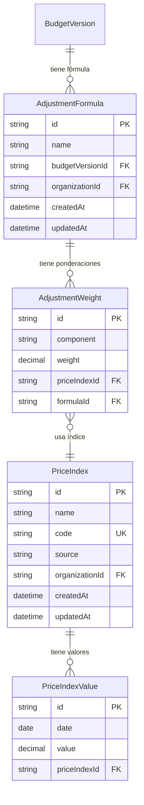

**Funcionamiento:**
- `PriceIndex` — índice de referencia (ej: INDEC materiales, UOCRA mano de obra)
- `PriceIndexValue` — serie histórica de valores con fecha
- `AdjustmentFormula` — fórmula polinómica: `F = Σ(peso_i × I_i_actual / I_i_base)`
- `AdjustmentWeight.weight` — las ponderaciones de todos los componentes deben sumar 1.0

---

## Dominio: Monedas y Tipos de Cambio

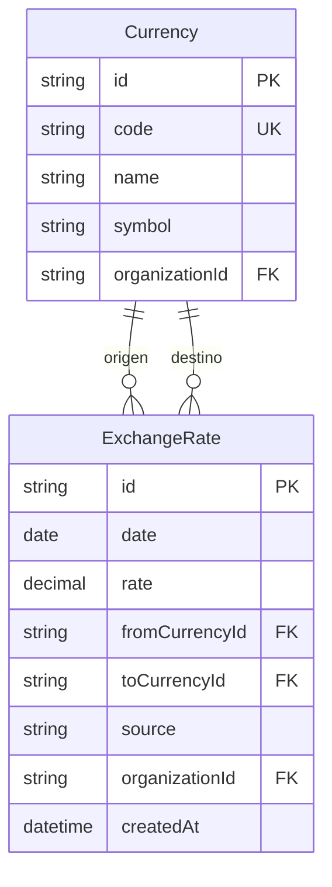

**Monedas predefinidas en seed:** ARS (peso argentino), USD (dólar), EUR (euro).
El campo `source` registra la fuente del tipo de cambio (ej: BCRA, Banco Nación).

---

## Dominio: Gastos y Compras

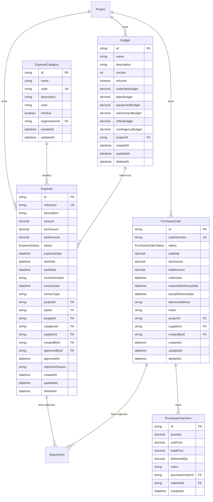

**Estados de Gasto (ExpenseStatus):** DRAFT → PENDING_APPROVAL → APPROVED → REJECTED → PAID
**Estados de OC (PurchaseOrderStatus):** DRAFT → SENT → CONFIRMED → PARTIAL_DELIVERY → COMPLETED → CANCELLED
**Tipos de factura argentina:** A, B, C
El campo `invoiceType` registra la clase de comprobante fiscal.

---

## Dominio: Proveedores y Materiales

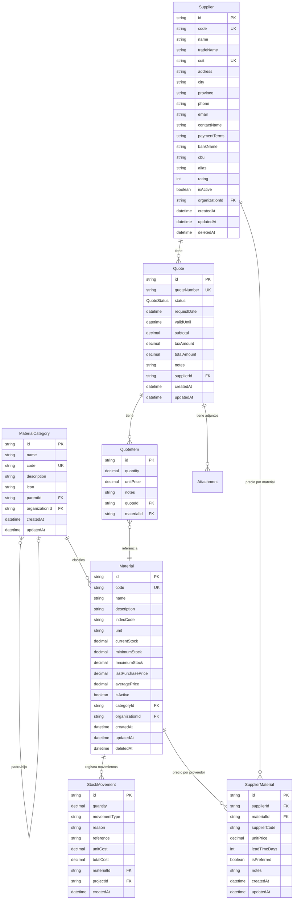

**Estados de cotización (QuoteStatus):** REQUESTED → RECEIVED → ACCEPTED / REJECTED / EXPIRED
`indecCode` permite vincular materiales a índices INDEC para redeterminación de precios.

---

## Dominio: Empleados y Asistencia

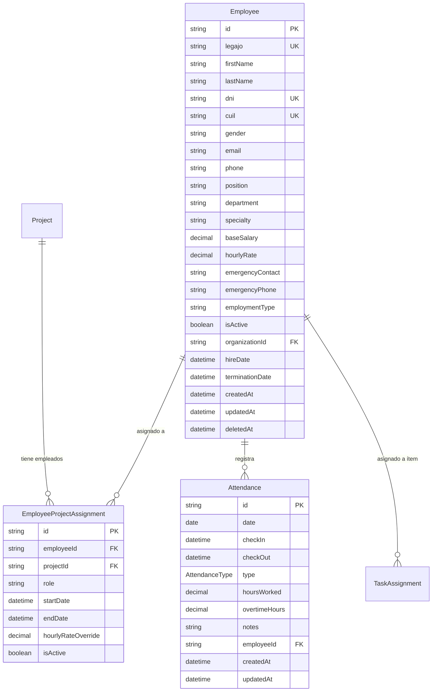

**Datos argentinos del empleado:** `legajo`, `dni`, `cuil` (con validación de dígito verificador)
**Tipos de asistencia (AttendanceType):** PRESENT · ABSENT · LATE · HALF_DAY · VACATION · SICK_LEAVE
**Tipos de empleo:** PERMANENT · TEMPORARY · CONTRACTOR

---

## Dominio: Catálogos (Mano de Obra y Equipos)

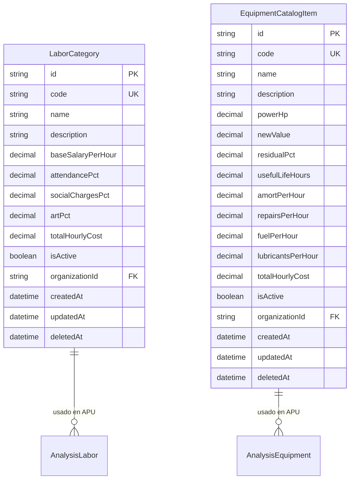

**LaborCategory:** precalcula `totalHourlyCost = baseSalaryPerHour × (1 + asistencia% + cargas%) + ART%`
**EquipmentCatalogItem:** precalcula `totalHourlyCost = amort + reparaciones + combustible + lubricantes`

Valores por defecto argentinos:
- `attendancePct`: 0.20 (20%)
- `socialChargesPct`: 0.55 (55%)
- `artPct`: 0.079 (7.9%)
- `residualPct`: 0.10 (10%)

---

## Dominio: Plan Financiero

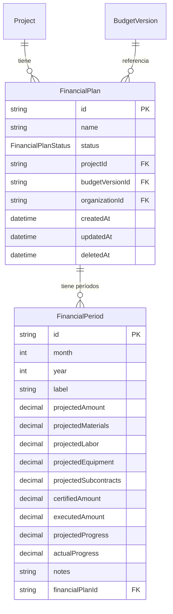

**Estados (FinancialPlanStatus):** DRAFT → APPROVED → SUPERSEDED
Cada período mensual registra proyectado vs. ejecutado vs. certificado, tanto en montos como en avance físico (0–1).

---

## Dominio: Soporte

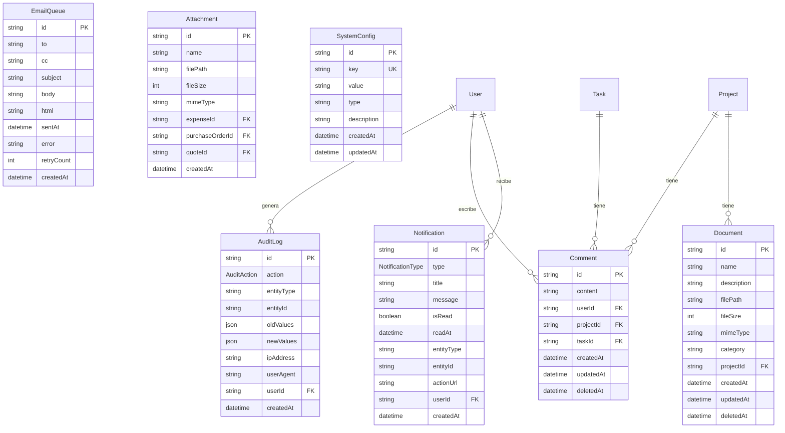

**Tipos de notificación (NotificationType):** TASK_ASSIGNED · TASK_COMPLETED · TASK_OVERDUE · EXPENSE_APPROVAL · EXPENSE_APPROVED · EXPENSE_REJECTED · BUDGET_ALERT · STOCK_LOW · PROJECT_UPDATE · GENERAL

**Acciones de auditoría (AuditAction):** CREATE · UPDATE · DELETE · SOFT_DELETE · RESTORE

`SystemConfig` almacena pares clave-valor para configuraciones globales (tipos: `string`, `number`, `boolean`, `json`).

---

## Enums

| Enum | Valores |
|------|---------|
| `UserRole` | ADMIN · PROJECT_MANAGER · SUPERVISOR · ADMINISTRATIVE · READ_ONLY |
| `ProjectStatus` | PLANNING · IN_PROGRESS · ON_HOLD · COMPLETED · CANCELLED |
| `TaskStatus` | PENDING · IN_PROGRESS · COMPLETED · BLOCKED · CANCELLED |
| `TaskPriority` | LOW · MEDIUM · HIGH · URGENT |
| `ExpenseStatus` | DRAFT · PENDING_APPROVAL · APPROVED · REJECTED · PAID |
| `PurchaseOrderStatus` | DRAFT · SENT · CONFIRMED · PARTIAL_DELIVERY · COMPLETED · CANCELLED |
| `QuoteStatus` | REQUESTED · RECEIVED · ACCEPTED · REJECTED · EXPIRED |
| `AttendanceType` | PRESENT · ABSENT · LATE · HALF_DAY · VACATION · SICK_LEAVE |
| `NotificationType` | TASK_ASSIGNED · TASK_COMPLETED · TASK_OVERDUE · EXPENSE_APPROVAL · EXPENSE_APPROVED · EXPENSE_REJECTED · BUDGET_ALERT · STOCK_LOW · PROJECT_UPDATE · GENERAL |
| `AuditAction` | CREATE · UPDATE · DELETE · SOFT_DELETE · RESTORE |
| `BudgetVersionStatus` | DRAFT · APPROVED · SUPERSEDED |
| `CertificateStatus` | DRAFT · SUBMITTED · APPROVED · PAID |
| `SubcontractStatus` | DRAFT · ACTIVE · COMPLETED · CANCELLED |
| `DependencyType` | FS · SS · FF · SF |
| `FinancialPlanStatus` | DRAFT · APPROVED · SUPERSEDED |

---

## Reglas de integridad

| Regla | Detalle |
|-------|---------|
| **Multi-tenancy** | Toda entidad tiene `organizationId`. Nunca consultar sin filtrar por org. |
| **Soft delete** | Entidades críticas usan `deletedAt`. Consultar siempre con `deletedAt: null`. |
| **Montos monetarios** | `Decimal(15,2)` — hasta $999.999.999.999,99 ARS |
| **Porcentajes** | `Decimal(6,4)` — rango 0–1 (ej: 0.21 = 21% IVA) |
| **Presupuesto aprobado** | `BudgetVersion.status = APPROVED` es de solo lectura |
| **Un presupuesto activo** | Al aprobar una versión, las anteriores pasan a SUPERSEDED |
| **Avance** | `ItemProgress.advance` y campos similares en `Decimal(8,6)` (0.000000 – 1.000000) |
| **Ponderaciones APU** | `AdjustmentWeight.weight` deben sumar exactamente 1.0 por fórmula |
| **Códigos únicos** | `Project.code`, `BudgetVersion.code`, `Certificate.code`, `Expense.reference`, etc. son `@unique` |
| **CUIT** | Formato XX-XXXXXXXX-X con validación de dígito verificador en capa de aplicación |
| **CUIL** | Igual que CUIT pero para personas físicas |
| **CBU** | 22 dígitos con dígito verificador de banco y cuenta |
| **Cascada** | `onDelete: Cascade` en relaciones padre→hijo (BudgetCategory→Stage→Item, BudgetItem→PriceAnalysis, Stage→Task, Subcontract→Items, etc.) |
